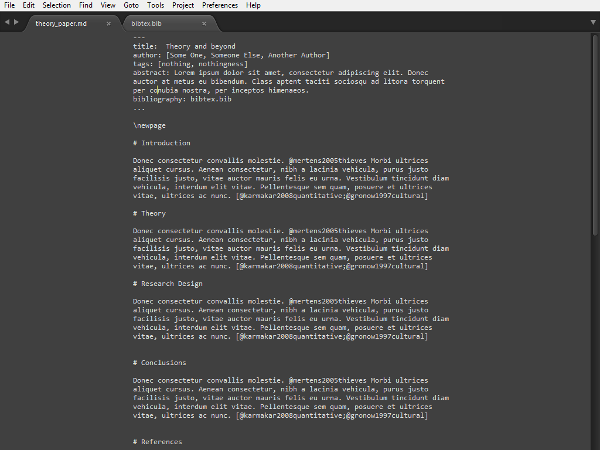
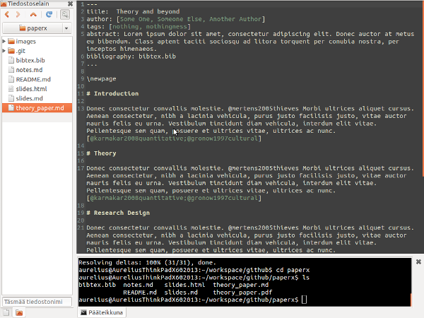

# RESEARCH METHODS/TOOLS

## Resources for writing academic papers in plain text

The core idea is could be described as *source code approach to academic writing* in which you will need:

1. a text editor of your liking for editing the *source code*
    - **Notepad** is good, but for windows I recommend [Markdown Pad](http://markdownpad.com/) and 
    - for OS X maybe [Mou](http://mouapp.com/), [Clockwork Engine](http://clockworkengine.com/lightpaper-mac/) or perhaps [TEXTS](http://www.texts.io/). 
    - Also, [Sublime Text](http://www.sublimetext.com/) is an excellent editor of all OS's.
    - There are several others if you google 
2. [pandoc](http://johnmacfarlane.net/pandoc/) for converting *source code* into formats you like
    - [syntax for pandoc markdown](http://johnmacfarlane.net/pandoc/README.html#pandocs-markdown)
    - [try pandoc online](http://johnmacfarlane.net/pandoc/try/)
    - [install pandoc](http://johnmacfarlane.net/pandoc/installing.html)
3. [latex](http://www.latex-project.org/) for scientific journal article pdf's

### General introductions

- in English a this is great starting point: [WRITING AND PRESENTING SOCIAL SCIENCE](http://kieranhealy.org/resources/)
- in Finnish from my blog: [Markdown ja pandoc - tekstipohjaisen tieteellisen kirjoittamisen työvirta](http://markuskainu.fi/blog/tools/2013/10/15/markdown-pandoc-tieteellinen-teksti.html) 

### Some screenshots

Sublime text 3 in Windows 

Gedit 3 in Ubuntu-linux (with embedded shell)

## Collaborative writing tools

There are several web based solutions and more popping up all the time. 

### For sketching

- [http://muistio.tieke.fi/](http://muistio.tieke.fi/)
- [http://kirjoitusalusta.fi/](http://kirjoitusalusta.fi/)
- google docs

### For academic writing

- [https://www.authorea.com/](https://www.authorea.com/)
- [https://editorially.com/](https://editorially.com/)
- [https://draftin.com/](https://draftin.com/)
- [http://www.penflip.com/](http://www.penflip.com/)

## Presentation frameworks

- [http://slid.es/](http://slid.es/)
- [http://prezi.com](http://prezi.com/)

## Analytical tools

### Computation analysis
- [R-project for statistical computing and graphics](http://www.r-project.org/)
    -  [CRAN Task View: Natural Language Processing](http://cran.r-project.org/web/views/NaturalLanguageProcessing.html)
    - [CRAN Task View: Statistics for the Social Sciences](http://cran.r-project.org/web/views/SocialSciences.html)

### Examples of digital analysis tools in humanities
- [Kindred Britain](http://kindred.stanford.edu/#/story/full/none/half///centrality)
- [process of a slave revolt in Jamaica in 1760-1761 in a map](http://revolt.axismaps.com/index.php)
- [a Roman forum digitalized](http://dlib.etc.ucla.edu/projects/Forum/)
- [play with masterpieces](https://www.rijksmuseum.nl/en/rijksstudio)
- [Analyzing and locating blog and tweet feeds](http://workshops.boundlessgeo.com/tutorial-wordmap/)
- [Spatial History project at Stanford](http://www.stanford.edu/group/spatialhistory/cgi-bin/site/index.php)

### Qualitative analysis
- [http://www.umass.edu/qdap/](http://www.umass.edu/qdap/)
- [http://www.pressure.to/qda/](http://www.pressure.to/qda/)
